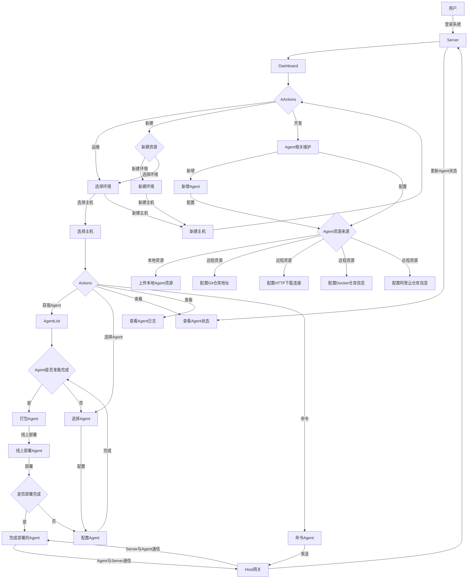

```mermaid
graph TD
    A[用户] -->|登录系统| Server[Server]
    Server --> Dashboard[Dashboard]
    Dashboard --> Action{AActions}
    Action -->|运维| Env[选择环境]
    Env -->|选择主机| Host[选择主机]
    Action -->|新建| NewOne{新建资源}
    Action -->|开发| Dev[Agent相关维护]
    Dev -->|新增| NewAgent[新增Agent]
    NewAgent -->|配置| AgentResource{Agent资源来源}
    Dev -->|配置| AgentResource
    AgentResource -->|本地资源| UploadAgentResource[上传本地Agent资源]
    AgentResource -->|远程资源| GitAgentResource[配置Git仓库地址]
    AgentResource -->|远程资源| HttpAgentResource[配置HTTP下载连接]
    AgentResource -->|远程资源| DockerAgentResource[配置Docker仓库信息]
    AgentResource -->|远程资源| AliyunAgentResource[配置阿里云仓库信息]
    NewOne -->|新建环境| NewEnv[新建环境]
    NewOne -->|选择环境| Env
    Env -->|新建主机| NewHost[新建主机]
    NewEnv -->|新建主机| NewHost
    NewHost --> Action
    Host --> HostAction{Actions}
    HostAction -->|获取Agent| Agent[AgentList]
    Agent --> IfAgentCompleted{Agent是否准备完成}
    HostAction -->|选择Agent| SelectAgent[选择Agent]
    HostAction -->|查看| AgentStatus[查看Agent状态]
    HostAction -->|查看| AgentLog[查看Agent日志]
    HostAction -->|命令| CommandAgent[命令Agent]
    CommandAgent -->|发送| Proxy
    IfAgentCompleted -->|是| PackageAgent[打包Agent]
    IfAgentCompleted -->|否| SelectAgent
    SelectAgent -->|配置| ConfigAgent[配置Agent]
    ConfigAgent -->|完成| IfAgentCompleted
    PackageAgent -->|线上部署| DeployAgent[线上部署Agent]
    DeployAgent -->|部署| IsDeployedCompleted{是否部署完成}
    IsDeployedCompleted -->|是| DeployedAgent[完成部署的Agent]
    IsDeployedCompleted -->|否| ConfigAgent
    DeployedAgent -->|Agent与Server通信| Proxy[Host网关]
    Proxy -->|Server与Agent通信| DeployedAgent
    Proxy --> Server
    Server --> |更新Agent状态| AgentStatus
```